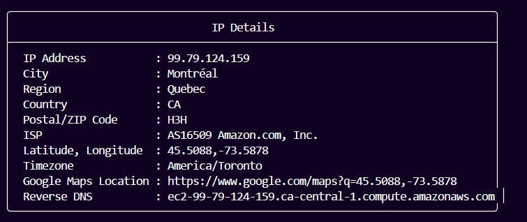

# Ola Osint Tool

**Ola Osint** is an Open Source Intelligence (OSINT) tool created for educational purposes, inspired by [ClatScope](https://github.com/Clats97/ClatScope). It gathers information across various factors utilizing multiple APIs and databases like Holehe, WHOIS, Have I Been Pwned, Google Search Engine API, and [HudsonRock](https://github.com/hudsonrock-partnerships).

## Features

- **IP Address Lookup**: Provides geolocation and reverse DNS details for IP addresses.
-    

- **Username Lookup**: Checks if a specified username exists within web accounts listed in `AccountSearch/list.txt`.

- **Phone Number Search**: Retrieves details such as country, region, operator, and validity of phone numbers.

- **Domain Search**: Collects A, CNAME, MX, NS records, and uses the WHOIS module to gather creation date, update date, name servers, and status information.

- **Email Lookup**: Gathers domain and MX records associated with an email address.

- **Email Account Lookup**: Uses the Holehe Python package to find accounts registered with a specified email.

- **Person Name Search**: Utilizes the Google Search Engine API to gather information about a specific person. Requires the Google Search API and Google Custom Search Engine key.

- **Email Raw Data Search**: Analyzes raw email data to extract information such as IP addresses and geolocation. To use, paste the raw email data, then type 'END' when finished.

- **Email Breach Check**: Checks if an email address has appeared in data breaches using the Have I Been Pwned API.

- **Password Analyzer**: Assesses password strength and checks if it appears in data breaches using the Have I Been Pwned API.

- **Username Search**: Searches for accounts associated with a username using the WhatsMyName repository.

- **Reverse Phone Search**: Uses the Google Search Engine API to retrieve detailed information about a phone number.

- **SSL Certificate Search**: Retrieves SSL certificate details of a domain name.

- **Robots.txt/Sitemap**: Gathers information from a domain's `robots.txt` and `sitemap.xml`.

- **DNSBL Check**: Performs a DNS Blacklist check on a specified IP address.

- **Web Metadata Info**: Extracts metadata from targeted websites.

- **File Metadata Info**: Gathers metadata from local files, including documents, audio, and image files.

- **HudsonRock Checks**: Uses HudsonRock to verify if emails, domains, usernames, or IP addresses are associated with information stealers.

- **Save Results**: Offers the option to save results from each function.

- **Change Text Color**: Allows customization of text color, with the ability to save preferences.

## Dependencies
- **Google API** and **Search Engine API**: Required for Person Name Lookup.
- **Have I Been Pwned API**: Required for Email Breach Check.

## Inspiration
Inspired by [ClatScope](https://github.com/Clats97/ClatScope) and [Holehe](https://github.com/megadose/holehe).

## Troubleshooting
Some modules may be blocked by VPNs or firewalls, especially those related to IP address and DNS lookups.

## False Positives
This tool is not perfect and may produce false positives, particularly with username and email account searches. The rapidly changing landscape can also affect the functionality of some modules.

## Disclaimer
**Ola Osint** is intended for educational purposes only. The creator is not responsible for any actions taken using this tool.
